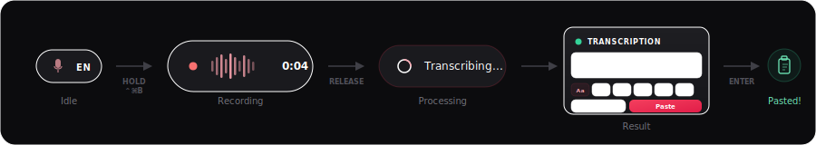
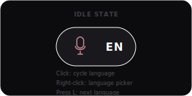
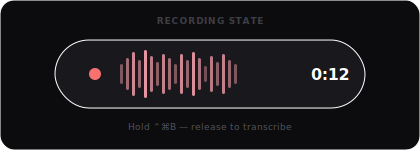
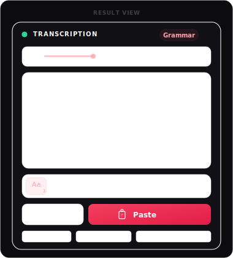
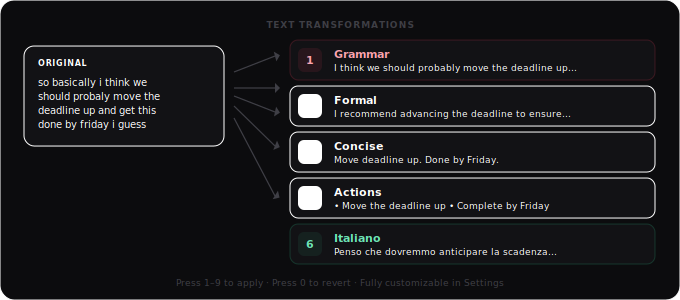
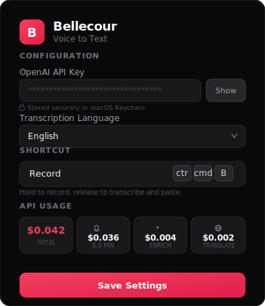
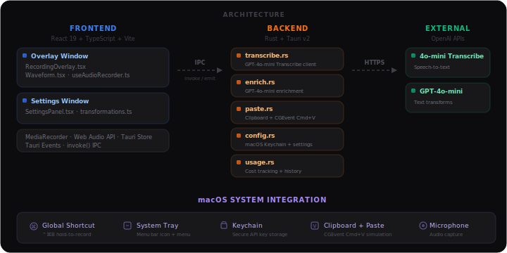

# Bellecour

**Voice to Text** — A lightweight macOS desktop app that transcribes your voice and pastes it directly where you need it. Hold a shortcut, speak, release, and your words appear as text.

Built with [Tauri v2](https://tauri.app/), React, and Rust.

<p align="center">
  
</p>

---

## Table of Contents

- [About](#about)
- [Features](#features)
  - [Hold-to-Record](#hold-to-record)
  - [Live Waveform](#live-waveform)
  - [Transcription & Auto-Paste](#transcription--auto-paste)
  - [Text Transformations](#text-transformations)
  - [Translation](#translation)
  - [Custom Transformations](#custom-transformations)
  - [Language Selection](#language-selection)
  - [Audio Playback](#audio-playback)
  - [Settings Panel](#settings-panel)
  - [API Usage Tracking](#api-usage-tracking)
  - [Secure API Key Storage](#secure-api-key-storage)
  - [System Tray Integration](#system-tray-integration)
  - [Dark & Light Mode](#dark--light-mode)
- [Technical Guide](#technical-guide)
  - [Architecture Overview](#architecture-overview)
  - [Prerequisites](#prerequisites)
  - [Installation](#installation)
  - [Development](#development)
  - [Building for Production](#building-for-production)
  - [Project Structure](#project-structure)
  - [Keyboard Shortcuts](#keyboard-shortcuts)
  - [macOS Permissions](#macos-permissions)
  - [Configuration Storage](#configuration-storage)

---

## About

Bellecour is a macOS menu bar application that turns your voice into text in seconds. It sits unobtrusively as a small floating pill on your screen, ready to record whenever you hold the global shortcut. Once you release the key, it sends the audio to OpenAI's Whisper API for transcription and displays the result in a compact overlay card. From there, you can refine the text with AI-powered transformations — fix grammar, change tone, extract action items, or translate — then paste the final result into any application with a single keystroke.

The app is designed for speed: the entire workflow from speaking to pasting takes just a few seconds and never requires switching windows or opening a separate app.

## Features

### Hold-to-Record

Press and hold **⌃⌘B** (Ctrl+Cmd+B) anywhere on your Mac to start recording. The idle pill expands into a recording indicator showing a pulsing red dot, a live waveform, and an elapsed time counter. Release the shortcut to stop recording and immediately begin transcription.

<p align="center">
  
</p>

### Live Waveform

While recording, a real-time audio waveform visualizes your microphone input. The waveform uses 28 frequency bars rendered on a canvas element, fed by the Web Audio API's `AnalyserNode`. The bars are smoothed between frames for an organic, fluid animation.

<p align="center">
  
</p>

### Transcription & Auto-Paste

When you release the shortcut, the recorded audio (WebM/Opus format) is sent to OpenAI's **Whisper** API for speech-to-text transcription. Once the transcription is ready, you can:

- **Press Enter** to automatically paste the text into the currently focused application. Bellecour writes the text to the system clipboard and simulates a `Cmd+V` keystroke via macOS CoreGraphics events.
- **Press Escape** to discard the transcription.
- **Edit the text** directly in the textarea before pasting.

<p align="center">
  
</p>

### Text Transformations

After transcription, a toolbar of AI-powered transformations lets you refine the text before pasting. Each transformation sends the original transcription to OpenAI's **GPT-4o-mini** model with a specialized system prompt. Built-in transformations include:

| # | Name | Description |
|---|------|-------------|
| 1 | **Grammar** | Fixes spelling, grammar, and punctuation while preserving meaning and tone |
| 2 | **Formal** | Rewrites text in a polished, professional tone for executive communication |
| 3 | **Fun** | Rewrites text to be funnier and more entertaining with clever wordplay |
| 4 | **Concise** | Ruthlessly cuts filler words, redundancy, and unnecessary qualifiers |
| 5 | **Actions** | Extracts actionable items as a bullet list, each starting with a verb |

Transformations are togglable — click the same transformation again (or press **0** / **Backspace**) to revert to the original transcription. Keyboard shortcuts **1–9** trigger transformations directly.

<p align="center">
  
</p>

### Translation

Built-in translation modes translate your transcription into another language while preserving tone and meaning:

| # | Name | Target Language |
|---|------|-----------------|
| 6 | **Italiano** | Italian |
| 7 | **English** | English |
| 8 | **Français** | French |

### Custom Transformations

From the Settings panel, you can fully customize the transformation toolbar:

- **Add** new transformations with a custom label, icon, and system prompt
- **Edit** the prompt of any existing transformation (including built-in ones)
- **Reorder** transformations using the up/down arrows (order determines keyboard shortcut assignment)
- **Delete** transformations you don't need
- **Reset** to defaults with a single click

Custom transformations use the same GPT-4o-mini pipeline as the built-in ones. Your prompt is sent as the system message, and the transcribed text as the user message.

### Language Selection

The idle pill displays the current transcription language (e.g., "EN", "IT", "FR"). You can:

- **Click** the pill to cycle through languages
- **Right-click** to open a compact language picker
- **Press L** while idle to cycle to the next language

Supported transcription languages: English, Italian, French, Spanish, German, Portuguese, Japanese, and Chinese. The selected language is sent as a hint to the Whisper API for improved accuracy.

### Audio Playback

After transcription, an audio player lets you replay the original recording to verify accuracy before pasting.

### Settings Panel

The settings window (accessible from the tray menu) provides:

- **OpenAI API Key** — required for Whisper and GPT-4o-mini. Stored securely in the macOS Keychain.
- **Transcription Language** — default language for speech recognition, with an expanded list of 12 languages.
- **Audio Input** — select a specific microphone or use the system default.
- **Transformations Editor** — full CRUD interface for managing text transformations.
- **Shortcut Reference** — shows the global shortcut (⌃⌘B).
- **API Usage Dashboard** — cost breakdown and history.

<p align="center">
  
</p>

### API Usage Tracking

Bellecour tracks every API call locally and displays a usage dashboard in Settings:

- **Total cost** across all operations
- **Cost breakdown** by category: Transcription, Enrichment, Translation
- **Total audio minutes** processed
- **Recent history** — the last 20 API calls with timestamps and individual costs

Costs are calculated using OpenAI pricing: Whisper at $0.006/minute, GPT-4o-mini at $0.15/1M input tokens and $0.60/1M output tokens. Usage data can be cleared at any time.

### Secure API Key Storage

The OpenAI API key is stored in the **macOS Keychain** using the `security-framework` crate, not in plaintext configuration files. If the app detects a key stored in the older plaintext format, it automatically migrates it to the Keychain on startup.

### System Tray Integration

Bellecour runs as a menu bar (tray) application with:

- A tray icon showing the app icon
- A context menu with "Settings..." and "Quit Bellecour" options
- Left-click opens the menu (same as right-click)
- Tooltip: "Bellecour — Voice to Text"

### Dark & Light Mode

The overlay UI and settings panel both adapt to the system appearance using `prefers-color-scheme`. The dark theme uses semi-transparent dark surfaces with rose accents; the light theme uses bright surfaces with adjusted contrast and shadows. Both themes use `backdrop-filter` for a frosted-glass effect.

---

## Technical Guide

### Architecture Overview

Bellecour is a **Tauri v2** application with two layers:

- **Frontend** — React 19 + TypeScript, bundled with Vite. Handles the overlay UI, settings panel, audio recording (via `MediaRecorder` + Web Audio API), and user interactions.
- **Backend** — Rust, powered by Tauri. Handles system-level operations: macOS Keychain access, clipboard management, CoreGraphics keystroke simulation, global shortcut registration, system tray, and HTTP requests to OpenAI APIs.

<p align="center">
  
</p>

The app defines **two windows**:

| Window | Label | Purpose | Size | Behavior |
|--------|-------|---------|------|----------|
| Overlay | `overlay` | Recording pill & result card | 64×34 → 300×80 → 400×500 | Transparent, borderless, always-on-top, not in taskbar |
| Settings | `settings` | Configuration panel | 480×720 | Standard window, hidden by default, centered |

Both windows load the same React app, which routes based on `window.location.pathname`.

### Prerequisites

- **macOS** 10.15 (Catalina) or later
- **Rust** (stable toolchain) — install via [rustup](https://rustup.rs/)
- **Node.js** (v18+) and **pnpm** (v10+)
- **Xcode Command Line Tools** — `xcode-select --install`
- An **OpenAI API key** with access to the Whisper and Chat Completions APIs

### Installation

```bash
# Clone the repository
git clone <repository-url>
cd belcour

# Install frontend dependencies
pnpm install
```

### Development

```bash
# Start the Tauri development server (frontend + backend)
pnpm tauri dev
```

This will:
1. Start the Vite dev server on `http://localhost:1420` with HMR
2. Compile the Rust backend
3. Launch the application

On first run, macOS will prompt for **Microphone** and **Accessibility** permissions. The Accessibility permission is required for the simulated `Cmd+V` paste keystroke.

### Building for Production

```bash
# Build the production bundle
pnpm tauri build
```

This produces a `.dmg` installer and a `.app` bundle in `src-tauri/target/release/bundle/`. The build process:
1. Compiles TypeScript and bundles the frontend with Vite
2. Compiles the Rust backend in release mode
3. Packages everything into a macOS application bundle

### Project Structure

```
belcour/
├── index.html                  # Overlay window entry point
├── settings.html               # Settings window entry point
├── package.json                # Frontend dependencies & scripts
├── vite.config.ts              # Vite config with multi-page input
├── tsconfig.json               # TypeScript configuration
├── src/                        # Frontend source (React + TypeScript)
│   ├── main.tsx                # React app bootstrap
│   ├── App.tsx                 # Window router (overlay vs. settings)
│   ├── App.css                 # Global styles
│   ├── transformations.ts      # Transformation definitions & icons
│   ├── hooks/
│   │   └── useAudioRecorder.ts # MediaRecorder hook with Web Audio analyser
│   └── components/
│       ├── RecordingOverlay.tsx # Main overlay UI (idle → recording → result)
│       ├── RecordingOverlay.css # Overlay styles (dark/light themes)
│       ├── SettingsPanel.tsx    # Settings window UI
│       ├── SettingsPanel.css    # Settings styles
│       └── Waveform.tsx        # Real-time audio waveform canvas
├── src-tauri/                  # Rust backend
│   ├── Cargo.toml              # Rust dependencies
│   ├── tauri.conf.json         # Tauri app configuration
│   ├── capabilities/
│   │   └── default.json        # Tauri v2 permission capabilities
│   ├── icons/                  # App icons (all sizes)
│   └── src/
│       ├── main.rs             # Entry point
│       ├── lib.rs              # App setup: tray, shortcuts, commands
│       ├── transcribe.rs       # Whisper API integration
│       ├── enrich.rs           # GPT-4o-mini text transformation
│       ├── paste.rs            # Clipboard + CoreGraphics Cmd+V simulation
│       ├── config.rs           # Keychain storage + settings access
│       └── usage.rs            # API usage tracking & cost calculation
└── app-icon.png                # Source icon file
```

### Keyboard Shortcuts

| Context | Key | Action |
|---------|-----|--------|
| Global | **⌃⌘B** (hold) | Start recording |
| Global | **⌃⌘B** (release) | Stop recording & transcribe |
| Idle | **L** | Cycle transcription language |
| Idle | **Right-click** pill | Open language picker |
| Result | **1–9** | Apply transformation #1–9 |
| Result | **0** or **Backspace** | Revert to original transcription |
| Result | **Enter** | Paste text into focused app |
| Result | **Escape** | Discard transcription |

### macOS Permissions

Bellecour requires two macOS permissions:

1. **Microphone Access** — For audio recording. macOS will prompt automatically on first use.
2. **Accessibility** — For simulating the `Cmd+V` paste keystroke via CoreGraphics events. Grant this in **System Settings → Privacy & Security → Accessibility**.

### Configuration Storage

| Data | Storage Location |
|------|-----------------|
| OpenAI API Key | macOS Keychain (`dev.brainrepo.bellecour`) |
| Language, Audio Device, Transformations | `settings.json` via Tauri plugin-store (app data directory) |
| API Usage Log | `usage.json` in the app data directory |
